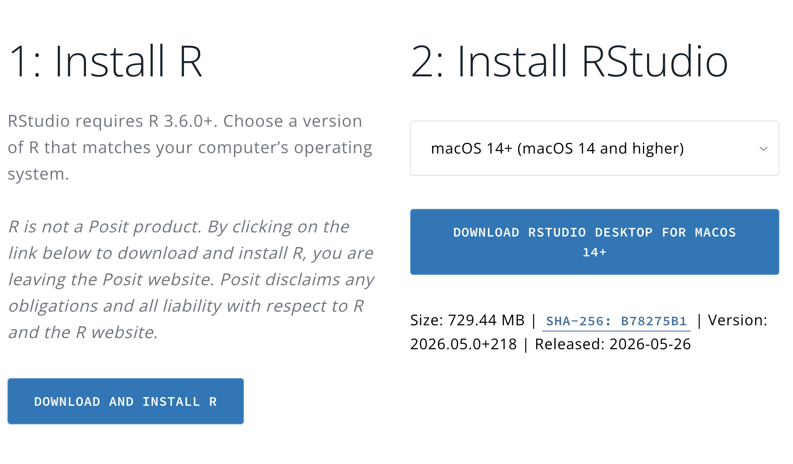

# Setup {.unnumbered}

You'll need to do two things to get yourself set up for this course: install R/RStudio and download the RProject used for the workshops. This page walks you through how to do that.

## Installing R and RStudio

You can download and install R/RStudio [from the posit website](https://posit.co/download/rstudio-desktop/):

{width="718"}

If you're using a laptop provided by your department, R/RStudio is probably available through the software centre. For example, for University of Melbourne devices, [see here](https://studentsoftware.unimelb.edu.au/?q=RStudio).

It's also possible to access RStudio through your browser using [myUniApps](https://studentit.unimelb.edu.au/myuniapps) or [WebR](https://webr.r-wasm.org/latest/), but these are not recommended as they are likely to be slow/unstable/lack some of the features of RStudio on your own computer.

## R project for BIOL90042 workshops

For the workshops in this course, we will work within a pre-made R project, so that everyone has the same files and folders. Before the first workshop in week 2, please:

1.  Download it using the button below
2.  Move it to wherever you like on your computer
3.  Unzip it (on mac: double-click, on windows: right-click, then click extract all)



Individual data file downloads

If for whatever reason you need to download the data files separately, here they are. The paths used in this course assume they are named as-is and located in a folder called 'data' that exists in the current working directory.





