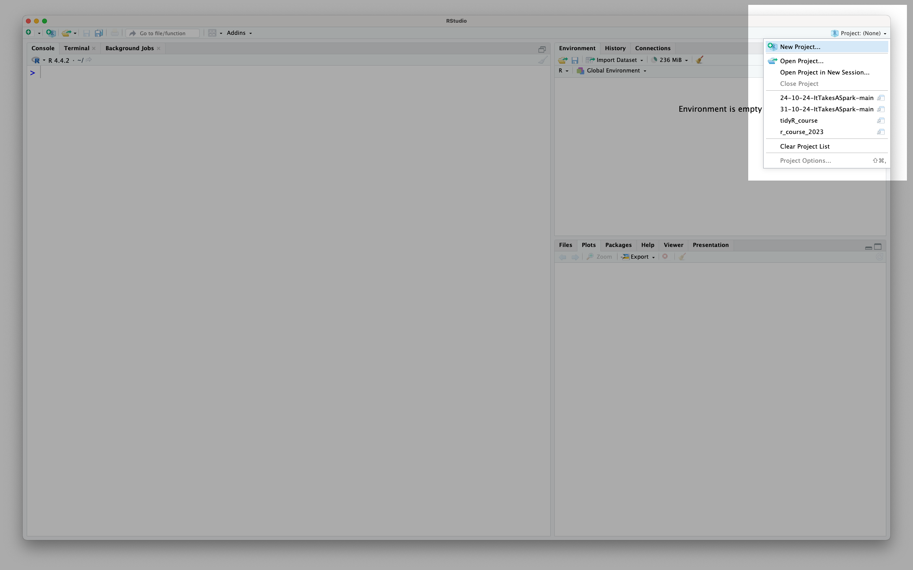
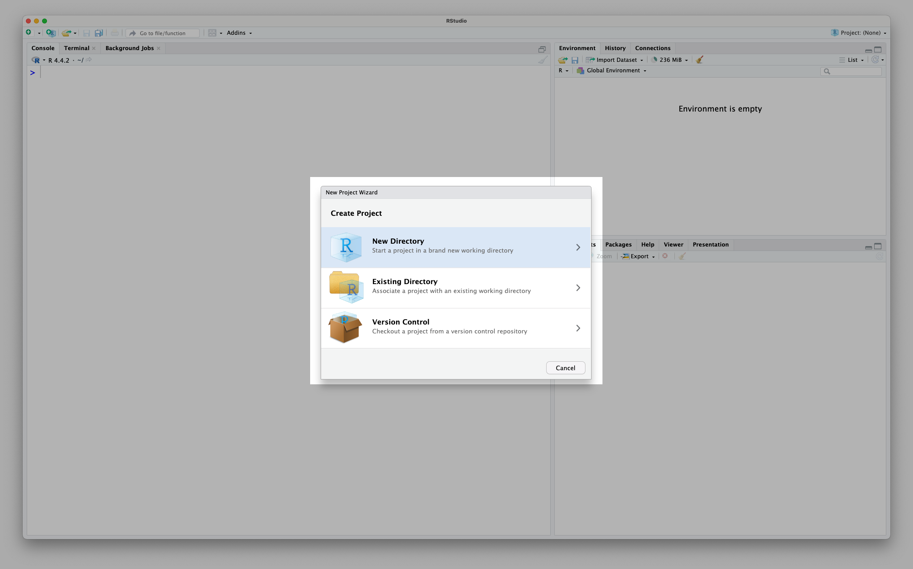
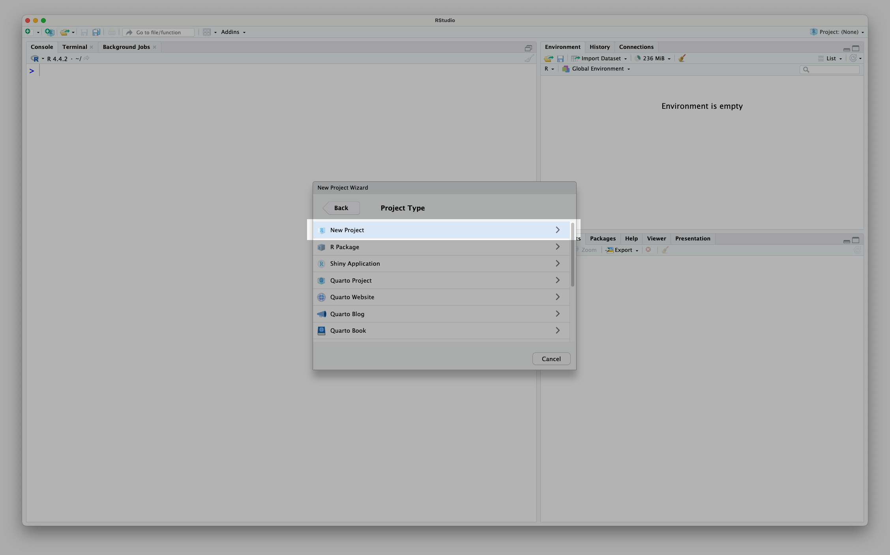
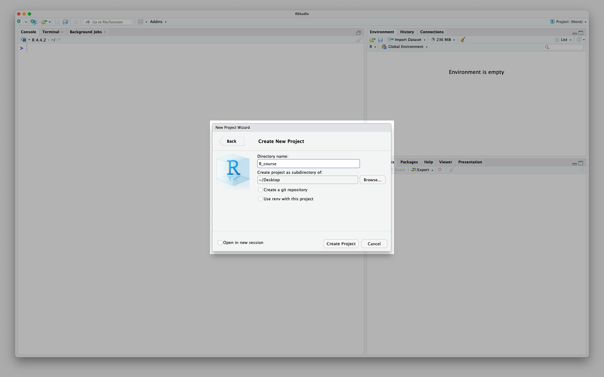

## Creating your own R project {#sec-fr-project}
To ensure everyone is working in a consistent environment for this course, we pre-made an R project for you to use. But what if you want to make your own project, for another analysis?

Recall from session 1 that you can see all of your R projects and create a new one in the top right hand corner of RStudio:

{width="960"}

Usually, you want to create a new project in a new directory (folder) so that everything stays organised:

{width="960"}

Next, we need to tell R that we want to make a 'New Project' and not any of the other fancy things we could create:

{width="960"}

Finally, we need to give our project an informative name:

{width="960"}

Don't forget to name with underscores and not spaces!

