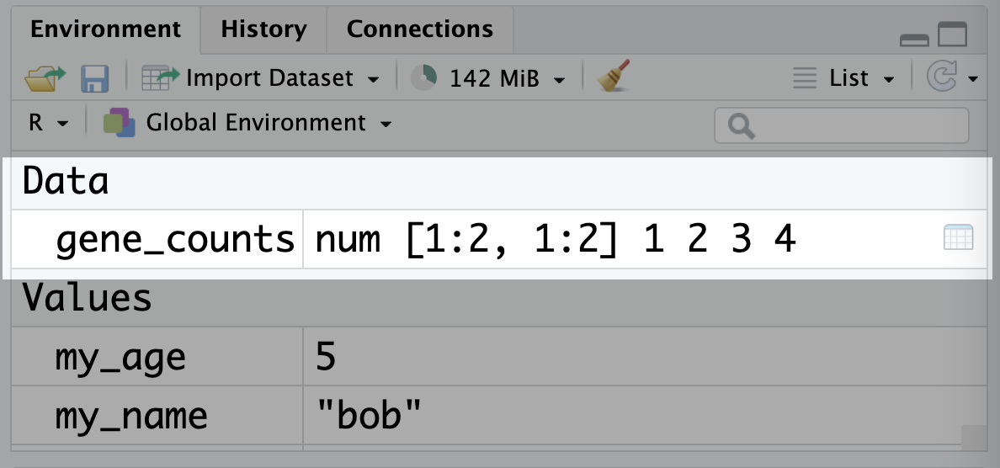

## Creating your own R project {#sec-fr-project}
To ensure everyone is working in a consistent environment for the BIOL90042 workshops, we pre-made an R project for you to use. But what if you want to make your own project, for another analysis?

Recall from workshop 1 that you can see all of your R projects and create a new one in the top right hand corner of RStudio:

{width="960"}

Usually, you want to create a new project in a new directory (folder) so that everything stays organised:

{width="960"}

Next, we need to tell R that we want to make a 'New Project' and not any of the other fancy things we could create:

{width="960"}

Finally, we need to give our project an informative name:

{width="960"}

Don't forget to name with underscores and not spaces!

## Matrices {#sec-matrices}

As described in Workshop 1 (see @sec-matrixbrief), matrices are essentially a bunch of vectors stuck together. All elements of a matrix must have the same type. An example of a matrix is a gene count matrices where each row represents a gene, each column represents a sample and therefore each cell represents the count for a particular gene in a particular sample.

You can create a matrix using the `matrix()` function. The first argument is the vector of values to be put into the matrix, and the `nrow` and `ncol` arguments specify the number of rows and columns in the matrix:

```{r}
# create a 2x2 matrix and assign it to gene_counts
gene_counts <- matrix(c(1, 2, 3, 4), nrow = 2, ncol = 2)

# print the matrix
gene_counts
```

Note that unlike data frames, the columns don't necessarily have names. Matrices are their own type of object in R:

```{r}
class(gene_counts)
```

And they show up in the environment panel in RStudio under 'Data', just like data frames do: {width="800"}

The rows and columns can be labelled with names, although these names are considered metadata rather than being a part of the matrix. You can set them by assigning vectors of names to the `rownames()` and `colnames()` functions:

```{r}
# set row and column names
rownames(gene_counts) <- c("gene1", "gene2")
colnames(gene_counts) <- c("sample1", "sample2")

# print the matrix, now with names!
gene_counts
```

You'll usually only interact with matrices in the context of RNA-seq analysis, which we will cover in @sec-workshop07.
