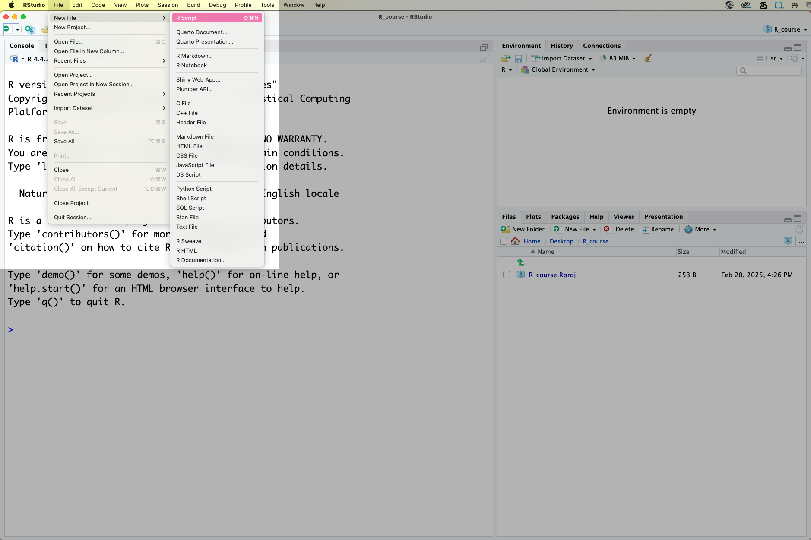
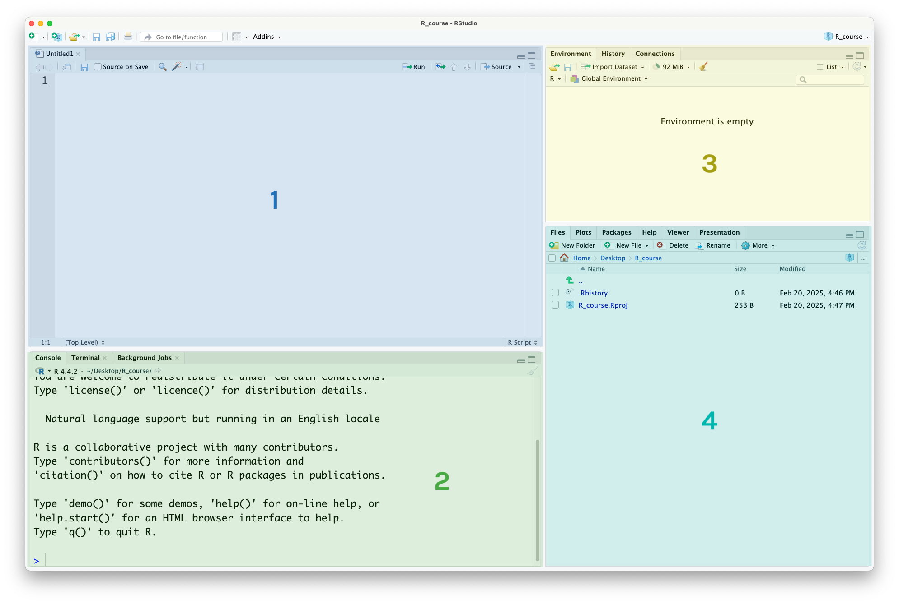
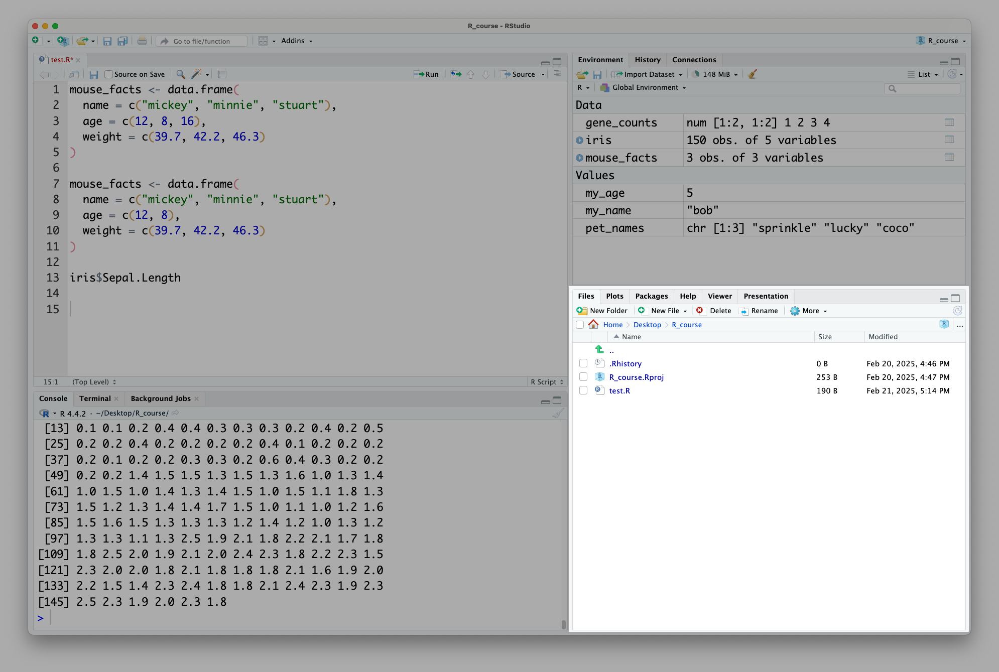
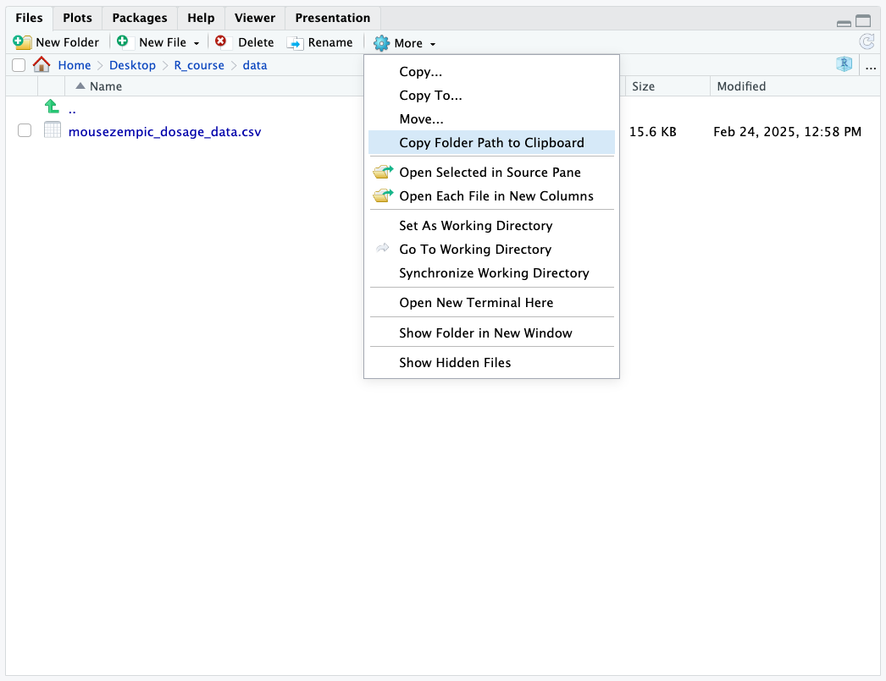

This content is covered in lecture 1, which is available to watch on canvas. For your convenience, we've provided a written version as well.

## Using RStudio {#sec-usingRstudio}

### What is R and RStudio? {#sec-whatIsR}

**R** is a free and popular statistical programming language, great for performing data analysis. **RStudio** is a free [integrated development environment (IDE)](https://en.wikipedia.org/wiki/Integrated_development_environment) that provides useful support features for writing code. In this subject, we will learn how to use RStudio's handy features like projects (which help us to keep track of different analyses) and the environment panel (which shows us all of our data/variables in one place).

### Creating an R script {#sec-createRScript}

Before we can start using RStudio, we first need to create a file to write our code in:

{width="960"}

This file is called an **R Script**. Don't forget to save your R Script as you work so you don't lose your progress! You can do this through the file menu or by using the keyboard shortcut 

### Overview of the RStudio layout

At this point, your RStudio window should look like this, with four different panels visible:

{width="960"}

This is what they're used for:

1.  **The R Script panel.** This is a text document where you can write code, and run it by highlighting the code or putting your cursor on that line, then pressing the 'run' button in the top-right corner or using the  keyboard shortcut.

2.  **The console.** This is where the output (results) of your code will appear. You can also run code in the console, by typing it next to the `>` symbol and pressing  but it's better to use the R Script, as the code you write there is saved and acts as a record of your work.

3.  **The environment panel.** This is where the data and variables you use in your analysis will be listed. More on this later.

4.  **The files/plot/help panel.**

    -   Under the 'files' tab you can see the files in your current folder

    -   Under the 'plots' tab you can view the plots you have created

    -   Under the 'help' tab you can read manual pages to learn how to use functions

Although there are other tabs for some of these panels, they are used for more niche things out of scope of this course. You can read more about it in the [RStudio documentation](https://docs.posit.co/ide/user/ide/guide/ui/ui-panes.html).

## Practicing R code with maths {#sec-maths}

To practice running R code, let's do some maths. Here's how to code some basic mathematical operations in R:

| Operation | Code | Example |
|----------------|----------------|----------------------------------------|
| Addition | `+` | one plus one: `1 + 1` |
| Subtraction | `-` | two minus ten: `2 - 10` |
| Multiplication | `*` | eight times 4: `8 * 4` |
| Division | `/` | ten divided by 3: `10 / 3` |
| Exponents | `^` | three squared: `3 ^ 2` |
| Brackets | `()` | sixteen divided by the result of three minus one: `16 / (3 - 1)` |

Like in regular maths, R follows the order of operations. Here, the `3 + 2` in the brackets will be evaluated first, and then result will be multiplied by 7.

```{r}
# brackets evaluate first
(3 + 2) * 7
```

You might notice when running this code that before the output (result), there is a number one that looks like this: `[1]`. This relates to the length of our output, which here is just one single number (hence the `1`). Later in the session we will write code with longer output, and the purpose of this number will become clearer, but you can ignore it for now.

::: {.callout-note title="Using whitespace in code"}
Above we used spaces between the numbers and mathematical operators in our code. R understands code without spaces too, but this makes it easier to read. Note that this is different to when we are naming things, when spaces are bad!

```{r}
# spaces don't matter in code
3 ^ 2
# so both of these should give the same result
3^2
```
:::

::::::::::::::: {.callout-important title="Practice exercises"}
Try these practice questions to test your understanding

:::::::: question
1\. Which R expression would give me a result of 10?

::::::: choices
::: {.choice .correct-choice}
`(2 * 3) + (2 ^ 2)`
:::

::: choice
`(5 - 3) * 4`
:::

::: choice
`1 + 1`
:::

::: choice
`20 - 1`
:::
:::::::
::::::::

:::::::: question
2\. What would be the result of running this line of R code: `(43 + 2)^2 / 3`

::::::: choices
::: choice
10
:::

::: choice
2025
:::

::: choice
An error
:::

::: {.choice .correct-choice}
675
:::
:::::::
::::::::

<details>

<summary>Solutions</summary>

<p>

1.  `(2 * 3) + (2 ^ 2)` is equal to 10. If you're not sure, try copy-pasting this code into the console and running it! The best way to learn is by doing.

2.  The expression `(43 + 2)^2 / 3` will return 675. Note that R will perform the squaring before the division, so it's not necessary to use brackets to separate those two operators.

</p>

</details>
:::::::::::::::

You will have another opportunity to practice these skills in tutorial 1!

## Paths {#sec-paths}

Paths are a way to specify the location of a file or directory on your computer. When doing data analysis with R, paths tell it where to find a file you want to read in, or where an output (e.g. a graph) should be saved.

**You can think of paths as essentially a set of instructions that tell a computer how to get from the folder it is currently in, to another folder or file.** They are written from left to right, starting with the folder and ending with the file. Slashes are used to separate each file/folder name, but the direction of the slash depends on your operating system (`/` for Unix-based systems like Linux and MacOS or `\` for Windows).

For example, if I have a file called `my_data.csv` in a folder called `data` then the path to this file would be `data/my_data.csv` (on mac/linux) or `data\my_data.csv` (on windows).

There are two ways to write a path: **absolute** or **relative**.

### Absolute paths

An 'absolute path' is defined as the full path from the root directory of the computer. They start with the root directory, which is `/` on Unix-based systems (like Linux and MacOS) and `C:\` on Windows systems. For example, (on a Unix-based system) the following is an absolute path `/home/my_username/analysis/data/file.txt`. These paths should be used when the location of the file is not going to change and is in some shared location external to the project.

### Relative paths

'Relative paths' are defined as a path relative to the current working directory (working directory refers to the folder that you are currently in). If you are already in the directory `/home/users/my_username/analysis/`, the relative path to the file `data/file.txt` would be have the same meaning as the absolute path `/home/users/my_username/analysis/data/file.txt`.

Relative paths are useful when the location of the file is likely to change, for example if the whole analysis folder might be moved around with its included data. However, you need to be careful that you always run code written with relative paths from the correct folder, otherwise the path will point to the wrong place. For example, if I am in the folder `/blah/blah/blah/` the relative path `data/file.txt` given above will resolve to `/blah/blah/blah/data/file.txt` rather than to the analysis folder!

When working within R Projects (as you should be in this subject!), it's recommended to use relative paths, as the Project will set the working directory for you, so your relative paths will be correct.

### Using RStudio to help you find paths

One other thing that can make paths easier is to use RStudio's file explorer panel to help you. First, open it by clicking on the 'Files' tab in the bottom right panel of RStudio:

{width="900"}

By default, it will put you in your project directory. If you have data files in a different directory, you can navigate to that directory by clicking on the folders. Here, I have navigated to a folder called 'data', which is inside the 'R_course' folder. Once you're in the right place, to get the path for that folder, click on `More > Copy Folder Path to Clipboard`:

{width="800"}

This will copy the path to the folder to your clipboard, which you can then paste into your R script. Then, you just need to add a `/` followed by the name of the file to the end of the path.

For example, the path to the folder in the above image is `~/Desktop/R_course/data`, so the path to the `mousezempic_dosage_data.csv` file is `~/Desktop/R_course/data/mousezempic_dosage_data.csv`.

Another option is to use the `rstudioapi::selectFile()` function. If you run this code from your console, it will bring up a graphical interface where you can select a file, and then return the path of that file.

### Read paths carefully!
When specifying paths, you need to be aware that the names of files and folders are **case-sensitive**. This means that 'BIOL90042' is not the same as 'biol90042' (actually, the same is true of basically everything in coding!). So, make sure you check carefully that you are using the correct capitalisation.

Other things to keep in mind are that spaces need to be treated carefully (known as 'escaping', it means putting an extra character before the space like `/` or `^` depending on your platform). So, spaces are generally not used and instead underscores `are_used_to_separate_words_like_this`. Also, so-called 'special characters' like ! @ # $ & etc are often not permitted or at least strongly discouraged, as they generally have other meanings to the computer (although it depends a bit on your operating system). **When naming things, stick to letters, numbers and underscores!**

::::::::::::::: {.callout-important title="Practice exercises"}
Try these practice questions to test your understanding

:::::::: question
1\. Which of the following paths correctly points to a file called 'genes.csv' that is located inside a folder called 'data'?

::::::: choices
::: choice
`data/ genes.csv`
:::

::: choice
`genes.csv`
:::

::: {.choice .correct-choice}
`data/genes.csv`
:::

::: choice
`Data/Genes.csv`
:::
:::::::
::::::::

:::::::: question
2\. Which of the following paths does **NOT** point to the same file as the other three?

::::::: choices
::: choice
`analysis/my_script.R` (assuming I am in the folder `/home/users/emily/`)
:::

::: choice
`/home/users/emily/analysis/my_script.R`
:::

::: choice
`my_script.R` (assuming I am in the folder `/home/users/emily/analysis/`)
:::

::: {.choice .correct-choice}
`/home/users/emily/analysis/my_script.r`
:::
:::::::
::::::::

<details>

<summary>Solutions</summary>

<p>

1.  `data/ genes.csv` has an un-escaped space in it, so this path is invalid, `genes.csv` does not include the name of the folder, and `Data/Genes.csv` has incorrect capitalisation. So, `data/genes.csv` is the correct choice.

2.  The odd path out is `/home/users/emily/analysis/my_script.r`, because it refers to the file `my_script.r` not `my_script.R`. The first three options are all the same path, with `/home/users/emily/analysis/my_script.R` being absolute and the other two being relative paths from different folders.

</p>

</details>
:::::::::::::::
