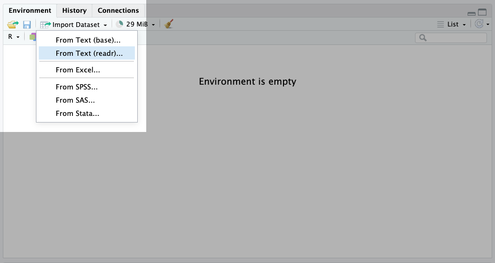
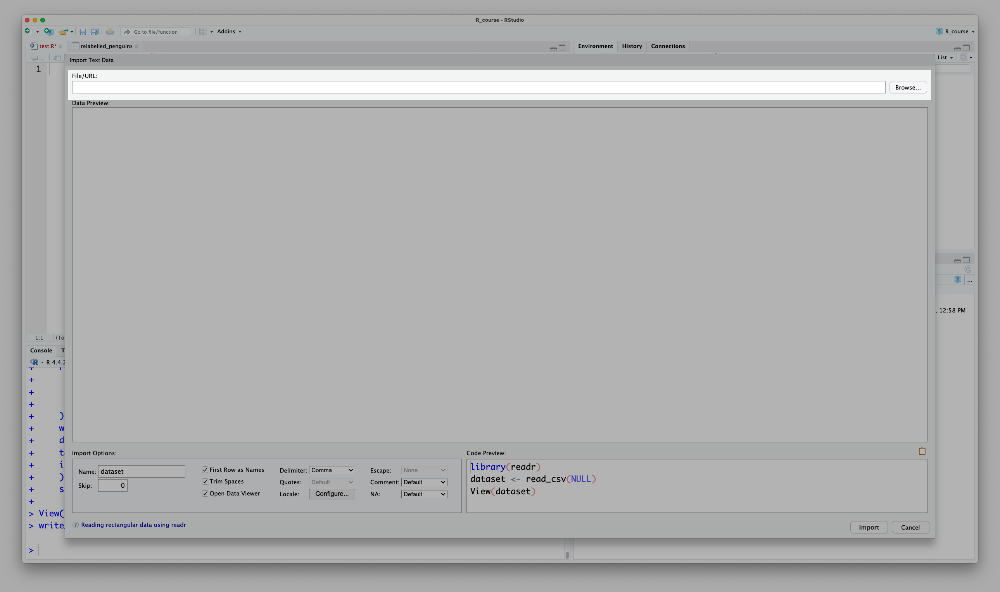
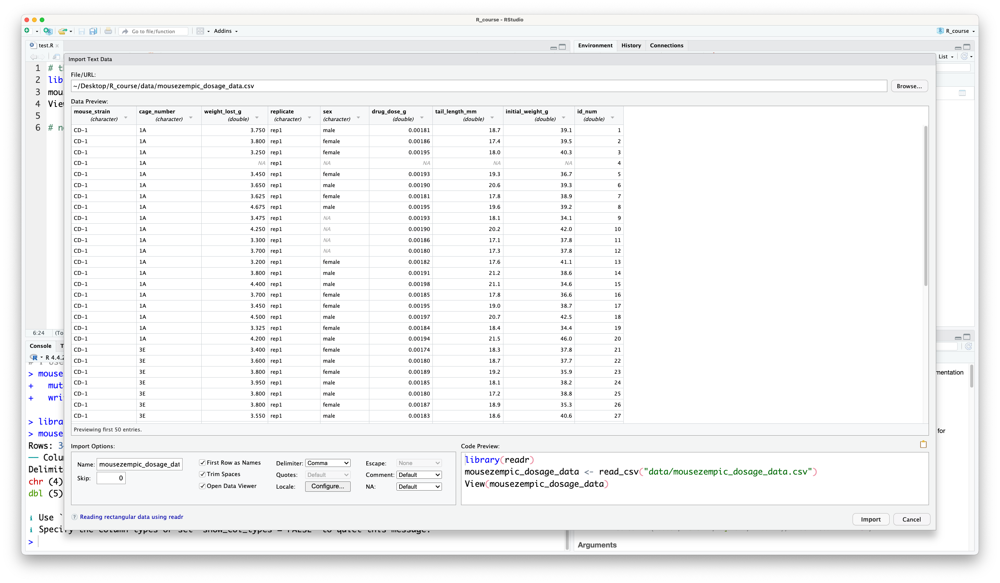
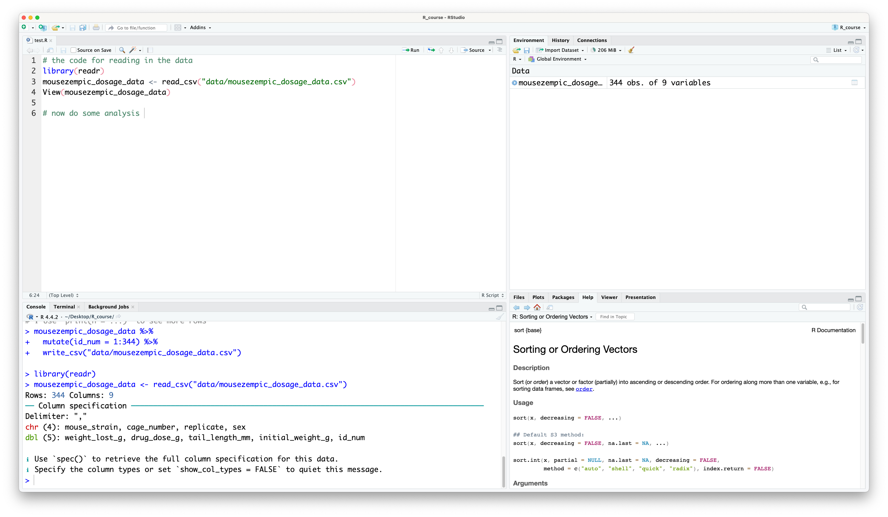

Recall how to use RStudio to find data files and read them in as data frames

# Workshop 2

## Reading in data {#sec-readingin}

So far, we've explored the basics of R by creating our own data, or using built-in data objects like `letters` or `iris`. However, in real life analyses, we almost always need to read in data from files on our computers.

In this section we will use the file named `mousezempic_dosage_data.csv`, which you can find in the 'data' folder of the R project provided with this course.

### Reading data with functions {#sec-readinFunctions}

Now that we know how to find our data, we can read it in. We'll do this using a handy package called `readr`, that is part of the `tidyverse`.

::: {.callout-note title="Packages in R"}
Packages are collections of functions that other people have written to help us do specific tasks, beyond what is built-in to R itself. The [tidyverse](https://www.tidyverse.org/) is a collection of packages that help to streamline data analysis in R. To use the tidyverse, we first need to install it. This is done using the `install.packages()` function, like so:

```{r}
#| eval: false
# install the tidyverse package
# only do this once
install.packages("tidyverse")
```

We only need to install a package once, but you must load it each time you open R. This is done using the `library()` function:

```{r}
# load the tidyverse package
# do this every time you open R
library(tidyverse)
```
You'll see some output from the `tidyverse` package when you load it, which is just telling you that some of the tidyverse functions have the same name as other functions in R.

If you forget to load a package, R will give you an error when you try to use that package's functions, so it's usually a good idea to load all the packages you'll need at the start of your script to prevent you forgetting to load them the next time you open R. We'll do this at the start of each session in this course.
:::

To read in our data, we'll use the `read_delim()` function from the `readr` package. This function takes in the path to the file you want to read in (in quotation marks `""`, as this is a character string) and returns as output a tibble (this is basically the same as a data frame).

```{r}
read_delim("data/mousezempic_dosage_data.csv")
```

::: {.callout-note title="Delimiters"}
The 'delim' in 'read_delim' stands for delimiter, and refers to the character used to separates columns of the data.

The most common types of delimiter are comma-separated values (.csv files) and tab-separated values (.tsv files). Here's an example of what they look like:

``` {filename="example.csv"}
Name, Age
Andy, 10
Bob, 8
```

\

``` {filename="example.tsv"}
Name  Age
Andy  10
Bob   8
```

By default `read_delim()` will guess your delimiter, so it's easiest to use that to read files, no matter their format. However, if you read other people's code, you might also encounter the `read_tsv()` and `read_csv()` functions which are specifically for reading in tab-separated and comma-separated files, respectively. It's up to you which you use, just make sure to get the delimiter right! If you try to read in a file with the wrong delimiter, it'll look like a mess.

<details>

<summary>What happens if we use the wrong delimiter?</summary>

As an example, let's try reading in our comma-separated file with `read_tsv()`, which is specifically for tab-separated files:

```{r}
read_tsv("data/mousezempic_dosage_data.csv")
```

We can see that the data is all in one column, which is not what we want!

</details>
:::

Depending on where you have put your data, your path to the `mousezempic_dosage_data.csv` file may be different. You should be able to find the path by following the instructions in the 'Paths' section above.

::: {.callout-note title="Using RStudio to autocomplete paths"}
Another conveninent way to get the path of your file (so long as you are working within an R project) is to use a feature called 'tab completion'. Within R projects, R can discover any files sitting in, or downstream of the project directory. So, assuming our `mousezempic_dosage_data.csv` file is located within a folder called 'data', if we start typing `read_delim("data/mouse` then press , R will auto-complete the full file path and close the quotes and bracket for us!
:::

Now, let's take a look at the output of `read_delim()`:

```{r}
read_delim("data/mousezempic_dosage_data.csv")
```

The first line tells us how many rows and columns are in the data. Then, the `Column specification` section tells you:

-   What delimiter was used to separate values.

-   Which columns belong to each type. `read_delim()` is quite clever and will guess this for us, but it's useful to check and make sure it's correct.

Then, the data will be printed out as a tibble.

::: {.callout-note title="Tibbles and data frames"}
Tibbles are a more modern version of data frames introduced in the [tidyverse](https://www.tidyverse.org/). They are very similar to data frames, but have some additional features like printing more nicely in the console.

Let's use `iris` to highlight the advantages of tibbles:

```{r}
#| message: false
# need to load the tidyverse package to use tibbles
# see below for more information on loading packages
library(tidyverse)
```

When we print a data frame, it shows every single row and column, which can be overwhelming if the data frame is large:

<details>

<summary>Click here to print `iris` as a data frame!</summary>

```{r}
# print iris
iris
```

</details>

But when we print a tibble, only a small preview is shown, which is much easier to read:

```{r}
# print iris as a tibble
as_tibble(iris)
```

It also tells us the number of rows (150) and columns (5) in the data, as well as the types of each column (`<dbl>` is short for `double`, which is a type of numeric data).

For the purpose of this course, we can treat tibbles and data frames as the same thing. However, if you're interested in learning more about tibbles, you can read about them [here](https://r4ds.had.co.nz/tibbles.html#tibbles-vs.-data.frame).
:::

No matter which function you use to read in your data, R simply prints the values out in the console. To actually work with data in R, we need assign our data frame to a variable:

```{r}
dosage <- read_delim("data/mousezempic_dosage_data.csv")
```

### Reading data through RStudio's graphical interface {#sec-readinGUI}

You can also read in data through RStudio's graphical interface. This is a good way to get the code to read in data if you're not sure how to do it yourself.

To do this, click on the 'Import Dataset' button in the environment panel (for our data, we will use the 'from Text (readr)' option):

{width="800"}

This will open a window where you can select the file you want to read in, like so:

{width="800"}

R will then generate the code to read in the data for you, and you can use the preview to check that it has worked ok:

{width="800"}

You can then copy this code and paste it into your script. This step is really important because not only does it helps you to learn how to read in data yourself, **it keeps a record in the script of how you read in the data so that you can reproduce your analysis later.**

{width="1000"}

::: {.callout-important title="Practice exercises"}
Try these practice questions to test your understanding

::: question
1\. What is a path?

::: choices
::: choice
A type of data in R
:::

::: choice
The data you want to analyse
:::

::: {.choice .correct-choice}
A string of characters that tells R where to find a file
:::

::: choice
A function in R
:::
:::
:::

::: question
2\. What is NOT a way to read in a file called `my_data.tsv` in R?

::: choices
::: choice
Using the `read_delim()` function
:::

::: choice
Using the 'Import Dataset' button in RStudio
:::

::: choice
Using the `read_tsv()` function
:::

::: {.choice .correct-choice}
Using the `read_csv()` function
:::
:::
:::

::: question
3\. What do we need to do before we can use functions from `readr` or any other R package?

::: choices
::: choice
Install it
:::

::: {.choice .correct-choice}
Install it, then load it into our R session using the `library()` function
:::

::: choice
Download it
:::

::: choice
Look at the help page for the functions we want to use
:::
:::
:::

<details>

<summary>Solutions</summary>

1\. A path is a string of characters that tells R where to find a file. Note that it isn't the data itself, but rather the location of the data.

2\. The `read_csv()` function is not a way to read in a file called `my_data.tsv`, because it is specifically for reading in comma-separated files, so it would not work for a tab-separated file like `my_data.tsv`.

3\. Before we can use functions from `readr` or any other R package, we need to install it, then load it into our R session using the `library()` function. Otherwise we will get an error message when we try to use the functions.

</details>
:::
