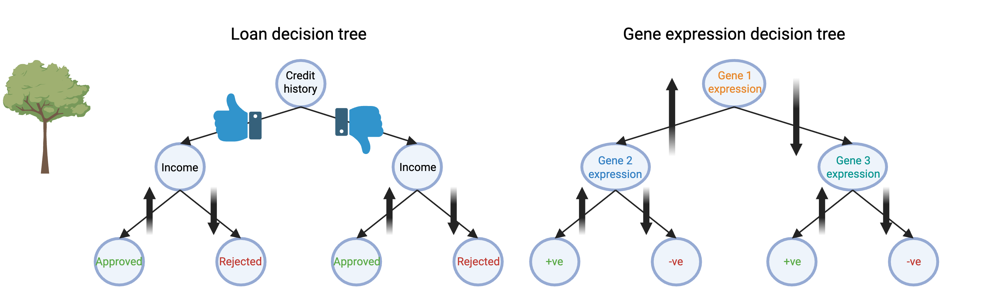
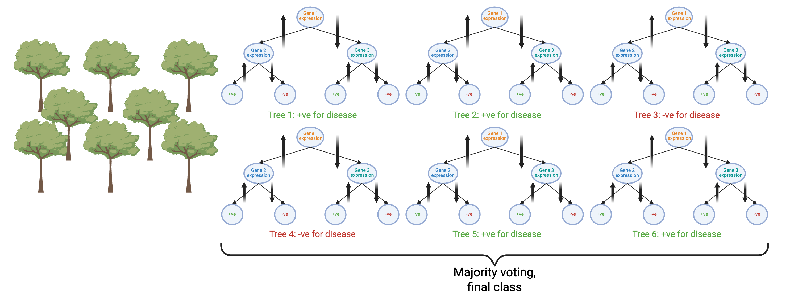

---
filters:
 - naquiz
format:
  html:
    toc: true
    toc-location: left
    toc-title: "In this session:"
---

# Workshop 8: Machine Learning {#sec-workshop08}

In this workshop, we will train, test and validate machine learning models.

::: {.callout-tip title="Learning Objectives"}
This workshop directly builds on today's lecture. At the end of this session, learners should be able to:

1. Compare supervised and unsupervised ML domains, and explore their applications in biomedical research (Background; [Part 1](#sec-w8-part1) & [Part 2](#sec-w8-part2))
2. Evaluate <a href="workshop_8_fr.html#k-means" class="tooltip-link" data-tooltip="An unsupervised clustering algorithm that partitions observations into k groups by iteratively assigning each point to its nearest centroid and updating centroids until they stabilise.">k-means clustering</a> (and, conceptually, <a href="workshop_8_fr.html#hierarchical-clustering" class="tooltip-link" data-tooltip="An unsupervised clustering approach that builds a dendrogram by repeatedly merging the two closest samples or clusters, without requiring the number of clusters to be fixed in advance.">hierarchical clustering</a>) for identifying discrete entities in unlabelled datasets ([Part 1](#sec-w8-part1))
3. Explain the <a href="workshop_8_fr.html#train-test-split" class="tooltip-link" data-tooltip="Dividing a dataset into a training set (used to fit a model) and a held-out test set (used to evaluate performance on unseen data).">train/test</a> paradigm for supervised ML, and key metrics for assessing performance — <a href="workshop_8_fr.html#confusion-matrix" class="tooltip-link" data-tooltip="A table comparing predicted class labels against true labels, with diagonal cells showing correct predictions and off-diagonal cells showing misclassifications.">confusion matrix</a>, <a href="workshop_8_fr.html#auroc-auprc" class="tooltip-link" data-tooltip="Area Under the ROC Curve / Area Under the Precision-Recall Curve — summary metrics of classification performance across all thresholds; AUPRC is more sensitive to class imbalance than AUROC.">AUROC, AUPRC</a> ([Part 2](#sec-w8-part2))
:::

To explore additional concepts discussed in the lecture beyond this workshop, such as [hyperparameter tuning](https://www.tidymodels.org/start/tuning/) and [cross-validation](https://www.tidymodels.org/start/resampling/) for improving model quality, see the tidymodels tutorials linked throughout this page.

## Background {#sec-mlbackground .unnumbered}

<a href="workshop_8_fr.html#machine-learning" class="tooltip-link" data-tooltip="A subset of AI where systems learn patterns from data to make decisions or predictions without being explicitly programmed.">Machine learning</a> (ML) is an umbrella term that encompasses classical statistical methods, linear models (both simple and generalised), and non-parametric techniques such as decision trees, support vector machines, autoencoders, and neural networks. Each of these methods are called machine learning <a href="workshop_8_fr.html#engines" class="tooltip-link" data-tooltip="A computational system or framework that executes a model or algorithm to process data and produce outputs.">engines</a> when used to train a <a href="workshop_8_fr.html#model" class="tooltip-link" data-tooltip="A mathematical representation learned from data that captures patterns and can be used to make predictions or decisions on new inputs.">model</a>.

ML forms the foundation of <a href="workshop_8_fr.html#artificial-intelligence" class="tooltip-link" data-tooltip="The broad field of computer science focused on building systems that simulate human-like reasoning, learning, and decision-making.">artificial intelligence</a>. For instance, large language models such as ChatGPT are trained using deep neural networks.

Machine learning refers to the use of computers (machines) to identify statistical trends in data and store those trends/relationships in a model. The process of identifying trends (<a href="workshop_8_fr.html#learning" class="tooltip-link" data-tooltip="The process by which an algorithm iteratively adjusts its internal parameters based on data to improve its performance on a task.">learning</a>) and then predicting features of newly provided data (<a href="workshop_8_fr.html#predicting" class="tooltip-link" data-tooltip="The application of a trained model to new, unseen data to produce an estimated output.">predicting</a>) is common to all ML workflows.

::: {.callout-note title="Does your machine need supervision?"}
ML used to predict the status (label) of new samples is termed <a href="workshop_8_fr.html#supervised-ml" class="tooltip-link" data-tooltip="A type of ML where a model is trained on labelled data, learning to map inputs to known outputs.">supervised ML</a>.

In <a href="workshop_8_fr.html#unsupervised-ml" class="tooltip-link" data-tooltip="A type of ML where a model finds hidden patterns or groupings in unlabelled data (e.g. clustering, dimensionality reduction).">unsupervised ML</a>, the model is trained on data without labels. The model tries to find patterns, groupings, or structures in the data, often by performing pair-wise sample similarity tests. This is useful when we don't know the categories in advance, such as clustering patients based on gene expression profiles, or identifying hidden patterns in imaging data.

Comparing 'data-driven' groupings to existing category labels can either confirm existing categories or provide evidence for revising them. <a href="workshop_8_fr.html#pca" class="tooltip-link" data-tooltip="A dimensionality reduction technique that transforms data into a smaller set of uncorrelated variables that capture the most variance.">Principal components analysis</a>, <a href="workshop_8_fr.html#mds" class="tooltip-link" data-tooltip="A technique that visualises the similarity or dissimilarity between data points by mapping them into a lower-dimensional space.">multidimensional scaling</a> and <a href="workshop_8_fr.html#tree-clustering" class="tooltip-link" data-tooltip="A hierarchical clustering approach that organises data into a tree structure, grouping similar observations at successive levels of granularity.">tree-based clustering</a> algorithms are examples of unsupervised ML.
:::

## Biomedical Context {#sec-mlcontext .unnumbered}

ML has many exciting applications in biomedical research. As you saw in the ML lecture, unsupervised and supervised ML workflows can be used on histological (imaging) features of tissue slices, with matched labels indicating whether the tissue is healthy/benign or malignant (cancerous) @Zhu2016. Another example of how ML can be used in this context is to identify whether patients infected with malaria are seropositive/seronegative based on specific anti-malaria IgG antibody levels @longley2020.

## Terminology {#sec-mlterms .unnumbered}

In training ML models, the machine 'learns from the training dataset' and 'predicts the validation dataset'. The accuracy of the predictions on the validation data is used to update the model (known as 'reinforcement learning').

Once the model has been trained, it is tested on a 'hold-out' or 'test' dataset, which has not been used at any point in training or validation. The accuracy of performance on the test set is the ultimate test of the 'predictive value' of a model — that is, how valuable it is for informing real-world decisions.

## Tidymodels and tidyclust packages {#sec-mlpackages .unnumbered}

[tidymodels](https://www.tidymodels.org/) is an R package that encompasses multiple sub-packages, all of which work together with tidy data. [tidyclust](https://tidyclust.tidymodels.org/) is an R package built upon the success of `tidymodels` that aims to provide a tidy, unified interface to unsupervised machine learning models.

In the past, each ML engine was siloed in its own package, with unique functions and arguments. `tidymodels` and `tidyclust` provide a consistent user experience for data pre-processing, training, validation, model tuning and prediction, and allow us to switch between ML engines quickly and easily!

::: {.callout-tip title="Further reading"}
To learn more about machine learning in R, check out the excellent book [Tidy Modelling with R](https://www.tmwr.org)
:::

# Setup {#sec-mlsetup}

```{r}
#| label: setup-w8-part1
#| include: false
#| echo: false 
#| fig-width: 12

rm(list = ls())
gc()
knitr::opts_chunk$set(fig.width = 10, fig.height = 7)
```

```{r}
#| label: setup-w8-part2
#| output: false
#| message: false

# Install packages if not already installed
# install.packages(c("tidyverse", "tidymodels",
#                    "tidyclust", "cluster", "factoextra",
#                    "ranger", "vip"))

library(tidyverse) # Data manipulation and visualisation
library(tidymodels) # Modelling framework
library(tidyclust) # Clustering extension for tidymodels
library(cluster) # Silhouette computation
library(factoextra) # Silhouette visualisation
library(ranger) # Random forest engine
library(vip) # Variable importance plots

theme_set(theme_bw())
```

## Download data & Quarto files



Save into your `data/` directory.

To run this workshop in quarto on your local machine:



then unzip, and copy the files into your R project home directory e.g. `BIOL90042_R_Course`.

## Read data

```{r}
mice_data <- read_csv(here::here("data/mousezempic_dosage_data.csv"))

mice_data
```

# Part 1: K-Means Clustering with tidyclust {#sec-w8-part1}

::: {.callout-tip title="Learning Objectives"}
**Aim:** Apply an unsupervised machine learning model to cluster mouse strains based on physiological and dosage features only.

**Methods:**

1. Exploring the data and consolidating our biological prior knowledge
2. Identify the number of k-clusters, specify a k-means algorithm and evaluate model predictions
3. Apply the k-means clustering algorithm on new data to predict strain
:::

## Prepare the Data

In this workshop we explore two fundamental machine learning techniques using the `mousezempic_dosage_data` dataset:

- **[Part 1: Unsupervised Learning](#sec-w8-part1):** K-means clustering with silhouette analysis using the `tidyclust` extension for `tidymodels`
- **[Part 2: Supervised Learning](#sec-w8-part2):** Random forest classification using the `tidymodels` framework

The `mousezempic_dosage_data` dataset contains measurements for **344 mice** across three strains (CD1, BALBc, and Black6) housed across three cages in a mouse husbandry facility.
<!-- as referenced in this chapter [OTHER CHAPTER](OTHER QMD FILE.qmd). -->

```{r}
#| label: mice-df

mice_data <- mice_data %>%
  mutate(
    mouse_strain = case_when(
      mouse_strain == "CD-1" ~ "CD1",
      mouse_strain == "Black 6" ~ "Black6",
      mouse_strain == "BALB C" ~ "BALBc"
    ),
    mouse_strain = as.factor(mouse_strain)
  )

glimpse(mice_data)
```

::: {.callout-note title="Biological Prior: How Many Clusters Should We Expect?"}
The best results will be obtained with prior knowledge of the optimal cluster number.

For the mousezempic dataset, we have a clear **biological prior**: there are **3 known strains** — CD1, BALBc, and Black6. This gives us a strong reason to expect `k = 3` to be the most biologically meaningful solution. We will use the silhouette analysis to **confirm or challenge** this prior, rather than selecting `k` blindly.
:::

We are going to explicitly keep only the numeric physiological features of our dataset and remove any missing values. Strain labels are deliberately **excluded** as we are aiming to use **unsupervised learning** - we do not want to inform the algorithm about strain identity.

```{r}
#| label: prepare-clustering-data

mouse_clust <- mice_data %>%
  drop_na() %>%
  select(initial_weight_g, tail_length_mm, drug_dose_g, weight_lost_g)

glimpse(mouse_clust)
```

## Explore the Data

Let's visualise the raw data by plotting initial weight (`initial_weight_g`) against drug dose (`drug_dose_g`).

```{r}
#| label: explore-data-2

mouse_clust %>%
  ggplot(aes(x = initial_weight_g, y = drug_dose_g)) +
  geom_point(size = 2.5, alpha = 0.8) +
  labs(
    title = "Mouse Initial Weight vs Drug Dose",
    x = "Initial Weight (g)",
    y = "Drug Dose (g)"
  )
```

Here we can see varying initial weights and drug doses across the *n* = 333 mice remaining in our dataset.

::::::::: {.callout-important title="Test Your Knowledge — Q1"}
:::::::: question
1\. Looking at the scatter plot above, how many natural groupings do you think you can see in the data?

::::::: choices
::: choice
1
:::

::: choice
2
:::

::: {.choice .correct-choice}
3
:::

::: choice
4
:::

:::::::
::::::::

<details>

<summary>Solutions</summary>

<p>

1.  There appear to be distinct clusters of points.
2.  There may be more than two groups. Look at the spread of points across both axes.
3.  Correct! There appear to be roughly three natural groupings, consistent with our biological prior of three strains. 
4.  While there is some spread, three groups is the most biologically supported answer.

</p>

</details>
:::::::::

## Define a Preprocessing Recipe {#sec-part1-recipe}

The <a href="workshop_8_fr.html#recipe" class="tooltip-link" data-tooltip="A tidymodels object that specifies the preprocessing steps (e.g. normalisation, dummy encoding) applied to data before a model is fit."><strong>recipe</strong></a> includes all of the variables (columns) that we want to include in our model, expressed as a statistical formula: `outcome variable ~ predictor variables`.

In **unsupervised learning**, we have no outcome variable because we do not know the class labels. Our recipe formula is therefore `~ .` (no outcome, all predictors).

As we saw in our figure above, the x- and y-axes are on markedly different scales. **Normalising** our data places all variables on a common scale where the mean = 0 and standard deviation = 1. This ensures that `weight_lost_g` (in grams) does not dominate `initial_weight_g` (in millimetres) simply because of its larger numeric range.

::: {.callout-note title="Why is normalisation essential for k-means?"}
K-means clustering assigns observations to clusters based on **Euclidean distance** — the straight-line distance between points in feature space. If one variable is measured in grams (thousands) and another in millimetres (tens), the gram-scale variable will dominate the distance calculation, regardless of its biological relevance. Normalisation removes this scale bias.
:::

```{r}
#| label: clustering-recipe

clust_recipe <- recipe(~., data = mouse_clust) %>%
  step_normalize(all_numeric_predictors())

summary(clust_recipe)
```

## Specify the K-Means Model

Now we have our recipe, we can specify our model using the `k_means()` function from `tidyclust`. We set our engine (`set_engine()`) to `"stats"`, which uses base R's built-in `kmeans()` function.

Setting `num_clusters = tune()` tells the workflow that we want to evaluate multiple values of *k* and identify the optimal one.

Setting `nstart = 25` runs the algorithm 25 times with different random centroid initialisations and keeps the best result. This is important because k-means is sensitive to where the centroids start.

```{r}
#| label: kmeans-spec

kmeans_spec <- k_means(num_clusters = tune()) %>%
  set_engine("stats", nstart = 25)

kmeans_spec
```

## Bundle into a Workflow

We now combine the recipe and model into a single <a href="workshop_8_fr.html#workflow" class="tooltip-link" data-tooltip="A tidymodels object that bundles a preprocessing recipe and a model specification together so they are applied consistently during fitting and prediction."><strong>workflow</strong></a> object. Bundling them together ensures that the same preprocessing steps are always applied consistently whenever the model is fitted or used to predict — reducing the risk of errors and making the pipeline reproducible.

```{r}
#| label: clustering-workflow

kmeans_workflow <- workflow() %>%
  add_recipe(clust_recipe) %>%
  add_model(kmeans_spec)

kmeans_workflow
```

## Define the Tuning Grid and Tune Over Values of k

Here we evaluate *k* from 2 to 8 clusters. We cap at 8 as there is no biological reason to expect more than a small number of morphologically distinct mouse groups. Recall that our biological prior suggests *k* = 3 (three strains).

```{r}
#| label: clustering-grid

clust_grid <- tibble(num_clusters = 2:8)
```

We create 10 **bootstrap resamples** of the data to obtain more stable silhouette estimates. We then tune the workflow across all values of *k*, collecting the `silhouette_avg` metric — a measure of how well each observation fits its assigned cluster relative to neighbouring clusters.

```{r}
#| label: tune-clusters

set.seed(123)

clust_resamples <- bootstraps(mouse_clust, times = 10)

kmeans_tuning <- tune_cluster(
  kmeans_workflow,
  resamples = clust_resamples,
  grid = clust_grid,
  metrics = cluster_metric_set(silhouette_avg)
)

collect_metrics(kmeans_tuning)
```

We now have an averaged silhouette estimate for each value of *k*, where values range from -1 (misclassified) to +1 (well-clustered). A score > 0.5 generally indicates reasonable cluster structure.

## Silhouette Plot Across k

We can visualise the mean silhouette width for each value of *k* using `ggplot2`. The red dashed line marks our biological prior of *k* = 3, allowing us to assess whether the data-driven optimum agrees with our prior knowledge.

```{r}
#| label: silhouette-plot

kmeans_tuning %>%
  collect_metrics() %>%
  filter(.metric == "silhouette_avg") %>%
  ggplot(aes(x = num_clusters, y = mean)) +
  geom_line(colour = "steelblue", linewidth = 1) +
  geom_point(colour = "steelblue", size = 3) +
  geom_errorbar(
    aes(ymin = mean - std_err, ymax = mean + std_err),
    width = 0.2,
    alpha = 0.6
  ) +
  geom_vline(
    xintercept = 3,
    linetype = "dashed",
    colour = "firebrick",
    linewidth = 0.8
  ) +
  scale_x_continuous(breaks = 2:8) +
  labs(
    title = "Average Silhouette Width by Number of Clusters",
    x = "Number of Clusters (k)",
    y = "Mean Silhouette Width"
  )
```

::: {.callout-tip title="Interpreting the silhouette plot"}
The <a href="workshop_8_fr.html#silhouette-score" class="tooltip-link" data-tooltip="A per-observation metric ranging from -1 to +1 that measures how similar an observation is to its own cluster compared to the nearest neighbouring cluster; higher values indicate better-separated clusters.">silhouette score</a> ranges from **-1** (poor, misassigned points) to **+1** (optimal, well-separated clusters). While the data-driven maximum may suggest a different `k`, we have a strong biological reason to select **k = 3** corresponding to the three known mouse strains. If `k = 3` yields a silhouette score close to the maximum, this provides quantitative support for our biological prior.
:::

::::::::: {.callout-important title="Test Your Knowledge — Q2"}
:::::::: question
2\. What does a silhouette score of 0 indicate for an observation?

::::::: choices
::: choice
The observation is perfectly assigned to its cluster
:::

::: {.choice .correct-choice}
The observation lies on the boundary between two clusters
:::

::: choice
The observation has been misassigned to the wrong cluster
:::

::: choice
The observation is an outlier
:::

:::::::
::::::::

<details>

<summary>Solutions</summary>

<p>

1.  A score of +1 indicates perfect assignment. A score of 0 means something different.
2.  Correct! A silhouette score of 0 means the observation is equally close to its own cluster and the nearest neighbouring cluster — it sits right on the decision boundary.
3.  Misassignment is indicated by a negative silhouette score, not zero.
4.  Outliers may have low silhouette scores, but a score of 0 specifically indicates a boundary observation.

</p>

</details>
:::::::::

## Select k = 3 Based on Biological Prior

Now that we have confirmed our biological prior of *k* = 3 can be supported quantitatively, we can finalise our k-means workflow.

```{r}
#| label: select-best-k

best_k_datadriven <- select_best(kmeans_tuning, metric = "silhouette_avg")
best_k <- tibble(num_clusters = 3)

sil_at_k3 <- kmeans_tuning %>%
  collect_metrics() %>%
  filter(.metric == "silhouette_avg", num_clusters == 3)

# Use finalize_workflow_tidyclust() — NOT finalize_workflow()
# tidyclust model specs are not parsnip objects so the standard
# tidymodels version will throw an error here
final_kmeans_workflow <- finalize_workflow_tidyclust(
  kmeans_workflow,
  best_k
)

final_kmeans_workflow
```

## Fit the Final K-Means Model

After finalising our workflow we can fit the k-means model on our `mouse_clust` dataset.

```{r}
#| label: fit-kmeans

set.seed(123)

final_kmeans_fit <- final_kmeans_workflow %>%
  fit(data = mouse_clust)
```

::: {.callout-tip title="Inspecting Centroids"}
Cluster centroids are reported in **scaled units** (because we applied `step_normalize()` in the recipe). Each row represents the centre of one cluster in the normalised feature space.
:::

```{r}
#| label: inspect-kmeans

extract_centroids(final_kmeans_fit)
```

We can now predict which cluster each individual mouse belongs to. This is done on a per-row basis using `predict()`.

```{r}
#| label: cluster-assignments-1

mouse_predicted_clusters <- predict(
  final_kmeans_fit,
  new_data = mouse_clust
)
```

We then bind our cluster predictions back to the original (unscaled) data using `bind_cols()`.

```{r}
#| label: cluster-assignments-2

mouse_clustered <- mice_data %>%
  drop_na() %>%
  bind_cols(mouse_predicted_clusters)

head(mouse_clustered, 10)
```

Now let's cross-tabulate the cluster assignments against the true strain labels. This reveals how well the unsupervised algorithm recovers the known biological groupings **without ever seeing the strain labels**.

```{r}
#| label: cluster-assignments-3

table(mouse_clustered$.pred_cluster, mouse_clustered$mouse_strain)
```

::: {.callout-tip title="Interpreting the final results"}
A strong correspondence between cluster assignments and strain labels (i.e., each cluster dominated by one strain) confirms that the physiological features alone are sufficient to distinguish the three strains, supporting our biological prior.
:::

::::::::: {.callout-important title="Test Your Knowledge — Q3"}
:::::::: question
3\. Looking at the cross-tabulation above, which strain appears to be the most difficult for the k-means algorithm to separate from the others?

::::::: choices
::: choice
CD1
:::

::: {.choice .correct-choice}
BALBc
:::

::: choice
Black6
:::

::: choice
All three are equally well separated
:::

:::::::
::::::::

<details>

<summary>Solutions</summary>

<p>

1.  CD1 mice tend to be well-separated in physiological feature space.
2.  Correct! BALBc mice share some physiological overlap with CD1 mice, particularly in tail length, making them the most likely to be misassigned.
3.  Black6 mice are typically well-separated due to their distinctly higher body weight and drug dose.
4.  Look at the off-diagonal entries in the table — some strains have more misassignments than others.

</p>

</details>
:::::::::

## Detailed Per-Observation Silhouette Plot

```{r}
#| label: detailed-silhouette

# Extract the scaled data from the fitted recipe
# We need this to compute pairwise distances for the silhouette
scaled_data <- clust_recipe %>%
  prep() %>%
  bake(new_data = mouse_clust)

# Compute silhouette widths for each observation
# Negative values indicate observations closer to a neighbouring
# cluster than their assigned cluster — possible misassignments
sil <- silhouette(
  x = as.integer(mouse_clustered$.pred_cluster),
  dist = dist(scaled_data)
)

fviz_silhouette(sil) +
  labs(
    title = "Silhouette Plot — K-Means, k = 3 (tidyclust)",
    subtitle = "Negative values suggest possible misassignment"
  ) +
  theme_minimal()

cat("Average silhouette width at k = 3:", round(mean(sil[, 3]), 3), "\n")
```

## Visualise Clusters via PCA Projection

We use Principal Components Analysis (PCA) to reduce our four physiological features to two dimensions for visualisation. This allows us to plot the cluster assignments in two dimensional space and compare them directly against the true strain labels.

```{r}
#| label: cluster-pca-plot

pca_result <- prcomp(scaled_data)

pca_plot_data <- pca_result$x %>%
  as_tibble() %>%
  select(PC1, PC2) %>%
  bind_cols(
    cluster = mouse_clustered$.pred_cluster,
    mouse_strain = mouse_clustered$mouse_strain
  )

p1 <- pca_plot_data %>%
  ggplot(aes(x = PC1, y = PC2, colour = cluster)) +
  geom_point(size = 2.5, alpha = 0.8) +
  stat_ellipse(aes(group = cluster), linetype = 2) +
  labs(
    title = "K-Means Clusters (k = 3): PCA Projection",
    subtitle = "Cluster assignments from unsupervised algorithm",
    colour = "Cluster"
  )

p2 <- pca_plot_data %>%
  ggplot(aes(x = PC1, y = PC2, colour = mouse_strain)) +
  geom_point(size = 2.5, alpha = 0.8) +
  stat_ellipse(aes(group = mouse_strain), linetype = 2) +
  labs(
    title = "True Strain Labels: PCA Projection",
    subtitle = "Ground truth for comparison with cluster plot",
    colour = "Strain"
  )

library(patchwork)
p1 + p2
```

::::::::: {.callout-important title="Test Your Knowledge — Q4"}
:::::::: question
4\. "Comparing the two PCA plots above, what does a strong visual match between the cluster assignments and the true strain labels tell us?"

::::::: choices
::: choice
The model has memorised the training data
:::

::: choice
We should increase k to get a better result
:::

::: choice
The silhouette score must be exactly 1.0
:::

::: {.choice .correct-choice}
The physiological features alone contain enough information to distinguish the three strains
:::

:::::::
::::::::
<details>

<summary>Solutions</summary>

<p>

1.  K-means is an unsupervised algorithm — it never sees the strain labels, so it cannot memorise them.
2.  A strong match at k = 3 supports our biological prior. Increasing k would split existing clusters unnecessarily.
3.  A strong visual match does not require a perfect silhouette score. Some overlap between strains is expected in real biological data.
4.  Correct! A strong match between unsupervised clusters and true strain labels confirms that initial weight, tail length, drug dose and weight lost are sufficient to separate the three strains — without any label information.

</p>

</details>
:::::::::

## k-Means vs Hierarchical Clustering

The lecture also introduced **hierarchical clustering** as a second unsupervised approach. Rather than iterating on centroids, hierarchical clustering builds a <a href="workshop_8_fr.html#dendrogram" class="tooltip-link" data-tooltip="A tree diagram produced by hierarchical clustering that records the order in which samples or clusters are merged, allowing the number of clusters to be chosen by cutting the tree at a given height."><strong>dendrogram</strong></a> ('clustering tree') by repeatedly merging the two closest samples or clusters, starting with every sample as its own cluster and finishing with a single cluster containing everything.

The number of clusters is not fixed in advance: instead, you *cut* the dendrogram at a chosen distance/height, and the number of branches crossed determines the number of clusters. This is different from k-means, where `num_clusters` must be specified before fitting.

In R, `hclust()` (base R) or `step_normalize()` + `dist()` + `hclust()` can build this tree, and `tidyclust::hier_clust()` provides a `tidymodels`-consistent interface analogous to the `k_means()` workflow used above. We won't run it in this core session — see the further reading below if you'd like to try it on `mouse_clust`.

::::::::: {.callout-important title="Test Your Knowledge — Q5"}
:::::::: question
5\. Which statement best distinguishes hierarchical clustering from k-means?

::::::: choices
::: choice
Hierarchical clustering requires the number of clusters to be specified before running the algorithm, just like k-means
:::

::: {.choice .correct-choice}
Hierarchical clustering builds a tree (dendrogram) from pairwise distances, allowing you to choose the number of clusters after seeing the tree
:::

::: choice
Hierarchical clustering does not depend on a distance metric between samples
:::

::: choice
k-means always produces better clustering results than hierarchical clustering
:::

:::::::
::::::::

<details>

<summary>Solutions</summary>

<p>

1.  This describes k-means, not hierarchical clustering — hierarchical clustering does not require *k* upfront.
2.  Correct! The dendrogram is built first, and the number of clusters is chosen afterwards by cutting the tree at a chosen height.
3.  Hierarchical clustering relies entirely on a distance (or similarity) metric between all pairs of samples.
4.  Neither method is universally better — the best choice depends on the structure of your data and whether you know the number of clusters in advance.

</p>

</details>
:::::::::

Congratulations on completing Part 1!

# Part 2: Random Forest Classification with tidymodels {#sec-w8-part2}

::: {.callout-tip title="Learning Objectives"}
**Aim:** Train a supervised machine learning model (classifier) to predict mouse strain based on physiological features.

**Methods:**

1. Explore the data
2. Train a machine learning model using pre-defined <a href="workshop_8_fr.html#hyperparameter" class="tooltip-link" data-tooltip="A model setting (e.g. mtry, k) chosen before training that controls how a model learns, as distinct from parameters estimated from the data itself.">hyperparameters</a>
3. Test the model and evaluate its performance
:::

## Setup

Our `mice` dataset is clean and well-separated — almost too clean. It's a great teaching dataset, but real-world data is rarely this tidy. To give a more realistic sense of how ML performs on messier data, we use a noisy version of the dataset, `noisy_mice`, created by adding random measurement error to the physiological features.

```{r}
noisy_mice <- read_csv(here::here("data/noisy_mice.csv"))
```

## Split Data into Training & Testing Sets

As we are now employing a **supervised ML** algorithm, we split our `noisy_mice` dataset into two distinct datasets: train and test. We train the model on the training set and evaluate it on the test set. The test set must **never** be seen during model training or tuning — this is what allows it to give an unbiased estimate of real-world performance.

We use a 75/25 train/test split (`prop = 0.75`) and stratify by strain (`strata = mouse_strain`) so that each set has proportional representation of all three strain.

```{r}
#| label: data-split

set.seed(123)

mouse_split <- initial_split(
  noisy_mice,
  prop = 0.75,
  strata = mouse_strain
)

mouse_train <- training(mouse_split)
mouse_test <- testing(mouse_split)
```

Great. Now let's confirm that our stratification was respected by inspecting our train and test datasets for their proportion of each strain. 

```{r}
#| label: data-split-1

train_check <- mouse_train %>%
  count(mouse_strain) %>%
  mutate(set = "train", proportion = round(n / sum(n), 2))

test_check <- mouse_test %>%
  count(mouse_strain) %>%
  mutate(set = "test", proportion = round(n / sum(n), 2))

bind_rows(
  train_check,
  test_check,
) %>%
  arrange(set, mouse_strain)
```

Now we repeat the same steps as [Part 1](#sec-w8-part1): define a recipe, specify a model and engine, bundle these into a workflow, and fit the model.

::: {.callout-note title="An alternative to a single train/test split"}
Instead of a single train/test split, we could train on the entire dataset and estimate performance using repeated <a href="workshop_8_fr.html#cross-validation" class="tooltip-link" data-tooltip="A resampling technique that repeatedly splits data into folds, training on some and evaluating on the rest, to obtain a more robust estimate of model performance than a single split.">cross-validation</a>, which reduces the bias introduced by any one particular split. See the tidymodels [cross-validation tutorial](https://www.tidymodels.org/start/resampling/) for a worked example of this approach.
:::

::::::::: {.callout-important title="Test Your Knowledge — Q6"}
:::::::: question
6\. Why must the test set never be used during model training or hyperparameter tuning?

::::::: choices
::: choice
It slows down computation too much to be practical
:::

::: {.choice .correct-choice}
Using it during training would let information leak into the fitting process, giving an overly optimistic estimate of real-world performance
:::

::: choice
The test set always contains different variables to the training set
:::

::: choice
It is only a concern for regression models, not classification
:::

:::::::
::::::::

<details>

<summary>Solutions</summary>

<p>

1.  Computation time is not the reason for the train/test split — it exists to give an honest estimate of performance.
2.  Correct! If the model (or its tuning process) ever sees the test set, performance estimates become biased ('data leakage') and no longer reflect how the model will perform on genuinely new data.
3.  The test set contains the same variables as the training set — only the *observations* differ.
4.  The train/test paradigm applies equally to regression and classification tasks.

</p>

</details>
:::::::::

## Define a Preprocessing Recipe

As this is a **supervised ML** workflow, we specify `mouse_strain` as the `outcome variable` in the recipe formula, and keep all remaining columns as `predictor variables`.

As in [Part 1](#sec-part1-recipe), we apply `step_normalize()` to scale all numeric predictors to mean = 0, sd = 1. This time we also have categorical predictors (`sex`, `cage_number`), which we convert to one-hot encoded numeric columns using `step_dummy()`.

```{r}
#| label: rf-recipe
#| 
mouse_recipe <- recipe(mouse_strain ~ ., data = mouse_train) %>%
  step_normalize(all_numeric_predictors()) %>%
  step_dummy(all_nominal_predictors())

summary(mouse_recipe)
```

::: {.callout-tip title="Curious about redundant predictors?"}
We use all four physiological features here without checking whether any are redundant. See the tidymodels [Feature Engineering and Selection](https://www.tidymodels.org/books/fes/) book for a discussion of checking for correlated predictors and reducing dimensionality.
:::

## Specify the Random Forest Model

A random forest is built from many individual **decision trees**. A single decision tree makes a prediction by asking a series of yes/no questions about the predictors, splitting the data at each step until it reaches a decision. For example, a bank might decide whether to approve a loan by first checking an applicant's credit history, then their income (@fig-decision-tree, left). The same logic applies in a biological context: a tree could classify a sample as disease-positive or -negative based on the expression levels of a few genes (@fig-decision-tree, right).

{#fig-decision-tree}

::: {.callout-tip title="What is a Random Forest?"}
A single decision tree can easily overfit its training data. A <a href="workshop_8_fr.html#random-forest" class="tooltip-link" data-tooltip="An ensemble of many decision trees, each trained on a random bootstrap sample of the data and a random subset of predictors at each split; averaging their predictions reduces overfitting relative to a single tree.">random forest</a> addresses this by growing an **ensemble** of many decision trees, each on a random bootstrap sample of the data, considering only a random subset of predictors at each split (`mtry`). This makes the trees independent and uncorrelated with one another. Every tree "votes" on the predicted class, and the forest's final prediction is simply the **majority vote** across all trees (@fig-random-forest), typically giving more accurate and stable predictions than any single tree.
:::

{#fig-random-forest}

Below we specify the random forest model. We use the default hyperparameters for `mtry` and `min_n`, and fix the number of trees at 500 (`trees = 500`). If you'd like to see how to systematically search for better hyperparameter values, see the tidymodels [hyperparameter tuning tutorial](https://www.tidymodels.org/start/tuning/).

For the engine, we use the [`ranger`](https://cran.r-project.org/package=ranger) R package, and set `importance = "impurity"` so that we can later calculate variable importance, which is a measure of how much each predictor contributes to classification accuracy.

```{r}
#| label: rf-spec

rf_model <- rand_forest(trees = 500) %>%
  set_engine("ranger", importance = "impurity") %>%
  set_mode("classification")

rf_model
```

## Bundle into a Workflow

```{r}
#| label: rf-workflow

# Combine the recipe and model into a workflow
rf_workflow <- workflow() %>%
  add_recipe(mouse_recipe) %>%
  add_model(rf_model)

rf_workflow
```

## Fit the Model

We now fit the final model on the full training set and evaluate it on the test set.

The `last_fit()` function fits the workflow once on the training data and generates predictions on the held-out test set in a single step. Recall that the test set has not been seen during training or tuning.

```{r}
#| label: finalise-rf

final_fit <- last_fit(rf_workflow, mouse_split)

final_fit
```

## Evaluate Model Performance

We can collect the test set performance metrics using `collect_metrics()`. By default this reports `accuracy` (the proportion of correctly classified mice) and `roc_auc` (AUROC, the Area Under the Receiver Operating Characteristic Curve).

```{r}
#| label: model-metrics

collect_metrics(final_fit)
```

We can also visualise performance using precision-recall (PR) and ROC curves. Since `mouse_strain` has three classes, `pr_curve()` and `roc_curve()` use a **one-vs-all** strategy, treating each strain in turn as the positive class against the other two.

```{r}
#| label: aupr-curve

final_fit %>%
  collect_predictions() %>%
  pr_curve(
    truth = mouse_strain, 
    .pred_BALBc, 
    .pred_Black6, 
    .pred_CD1
  ) %>%
  autoplot() +
  labs(title = "PR Curves: Random Forest (Test Set)")
```

ROC curves plot the true positive rate (sensitivity) against the false positive rate (1 - specificity) as the classification threshold varies. A curve that bows toward the top-left corner indicates better discrimination between classes, and an AUC closer to 1.0 indicates better overall classification performance.

```{r}
#| label: auroc-curve

final_fit %>%
  collect_predictions() %>%
  roc_curve(
    truth = mouse_strain, 
    .pred_BALBc, 
    .pred_Black6, 
    .pred_CD1
  ) %>%
  autoplot() +
  labs(title = "ROC Curves: Random Forest (Test Set)")
```

Because `mouse_strain` has three classes, this produces one curve per strain (each treating that strain vs. the other two) rather than a single combined curve.

We can also evaluate the confusion matrix (`conf_mat()`), where rows are our "truth" (the strain in `noisy_mice`; `truth = mouse_strain`) and columns are the "predictions" (the predicted strain; `estimate = .pred_class`). Diagonal cells are correct predictions, while off-diagonal cells are misclassifications. 

```{r}
#| label: confusion-matrix

final_fit %>%
  collect_predictions() %>%
  conf_mat(
    truth = mouse_strain,
    estimate = .pred_class
  ) %>%
  autoplot(type = "heatmap") +
  labs(title = "Confusion Matrix: Random Forest (Test Set)")
```

::: {.callout-note title="Try it yourself"}
Using `collect_predictions(final_fit)`, compute the sensitivity, specificity, positive predictive value (PPV) and negative predictive value (NPV) for each strain class (see the `yardstick` package functions: `sens()`, `spec()`, `ppv()`, `npv()`). The tidymodels [cross-validation tutorial](https://www.tidymodels.org/start/resampling/) works through a similar calculation in detail if you'd like a worked example.
:::

::::::::: {.callout-important title="Test Your Knowledge — Q7"}
:::::::: question
7\. A classifier has an AUROC of 0.90 but an AUPRC of only 0.30. What does this most likely indicate?

::::::: choices
::: choice
The model is performing extremely well overall, with no concerns
:::

::: {.choice .correct-choice}
The classes in the dataset are likely imbalanced — AUPRC is more sensitive to class imbalance than AUROC
:::

::: choice
AUPRC and AUROC should always be equal, so this must be a coding error
:::

::: choice
The confusion matrix is no longer needed once you have an AUROC value
:::

:::::::
::::::::

<details>

<summary>Solutions</summary>

<p>

1.  A high AUROC alongside a low AUPRC is a red flag, not a sign of strong performance — it usually means the model looks good on paper but struggles with the minority class.
2.  Correct! As shown in the lecture's imbalanced-data example, AUROC can remain high under class imbalance while AUPRC drops sharply, because AUPRC is sensitive to how rare the positive class is.
3.  These two metrics measure different trade-offs (sensitivity/specificity vs precision/recall) and are not expected to match.
4.  The confusion matrix, AUROC and AUPRC each reveal different aspects of performance and are best used together.

</p>

</details>
:::::::::

## Variable Importance Plot

You may be interested in understanding which predictor variable was the most important in informing the final classification prediction. We can do this by extracting the fitted model (`extract_fit_parsnip()`) and plotting variable importance using the `vip` R package.

Importance is measured by mean decrease in node impurity (Gini impurity), where higher values indicate a greater contribution to classification decisions. This tells us which physiological features best distinguish strains. 

```{r}
#| label: variable-importance

final_fit %>%
  extract_fit_parsnip() %>%
  vip() +
  labs(title = "Variable Importance: Random Forest")
```

Here we can see that `initial_weight_g` is the most important variable that informs our random forest, and `sex` as the least informative variable! 

## Predict Strain for the Synthetic Unlabelled Dataset

Now that we have a trained and evaluated model, we can use it to predict on genuinely new data — this is often the ultimate goal of training an ML model.

We load a new, unlabelled dataset, `mouse_new`, containing physiological measurements but no strain labels.

```{r}
#| label: predict-new-data

mouse_new <- read_csv("data/new_mice.csv") %>%
  # Convert character columns to factors to match the training data's
  # column types -- step_dummy() in the recipe expects factor predictors
  mutate(across(where(is.character), as.factor))

# Extract the final fitted model from last_fit()
final_model <- extract_workflow(final_fit)

# Generate class predictions and class probabilities
new_predictions <- mouse_new %>%
  bind_cols(
    predict(final_model, new_data = mouse_new),
    predict(final_model, new_data = mouse_new, type = "prob")
  )

# View predictions with confidence probabilities
head(new_predictions, 10)
```

It's often useful to wrap this prediction logic into a reusable function, so you (or a collaborator) can apply the saved model to any new dataset without repeating the code above.

```{r}
#| label: predict-mice-function

# Save the fitted model so it can be reloaded without re-training
saveRDS(final_fit, "model/mice.rds")

predict_mice <- function(df, model = "model/mice.rds") {
  # Match the column types used during training
  df <- df %>% mutate(across(where(is.character), as.factor))

  # Load the saved model
  final_fit <- readRDS(model)

  # Extract the fitted workflow from last_fit()
  final_model <- extract_workflow(final_fit)

  # Generate class predictions and class probabilities
  df %>%
    bind_cols(
      predict(final_model, new_data = df),
      predict(final_model, new_data = df, type = "prob")
    )
}

predict_mice(mouse_new)
```

Congratulations! You've completed the core [Part 1](#sec-w8-part1) and [Part 2](#sec-w8-part2) workshop content! 

<!-- 
# Session Info - see if Kathleen uses session info in previous workshops. 

```{r}
#| label: session-info

# Record package versions for reproducibility
sessionInfo()
``` -->
